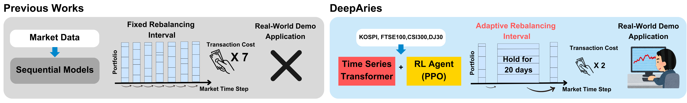

# DeepAries

[](https://arxiv.org/abs/2510.14985)
[](https://www.cikm2025.org)




This repository contains the source code for our paper, which introduces **DeepAries**—a novel reinforcement learning framework for dynamic portfolio management. Our framework leverages Transformer-based forecasting to extract complex market signals and adapts rebalancing intervals in response to changing market conditions. It has been evaluated across multiple major markets and has shown superior risk-adjusted returns and lower drawdowns compared to traditional fixed-horizon rebalancing strategies.

## Abstract

We propose DeepAries, a novel reinforcement learning framework for portfolio management that dynamically adjusts rebalancing intervals based on prevailing market conditions. Unlike conventional fixed-horizon strategies, DeepAries leverages Transformer-based forecasting to extract complex market signals and employs an adaptive interval selection mechanism—choosing among representative horizons (1, 5, and 20 days)—to balance return pursuit against transaction cost mitigation. Extensive experiments across four major markets (DJ 30, FTSE 100, KOSPI, and CSI 300) demonstrate that our approach achieves superior risk-adjusted returns and lower drawdowns compared to fixed-frequency rebalancing. Furthermore, an interactive demo evaluation on real market data (September 2024 to January 2025) illustrates the practical benefits of adaptive rebalancing in providing timely portfolio updates and empowering investors with more informed decision-making. Overall, DeepAries offers a promising tool for modern, dynamic portfolio management. To enhance accessibility and reproducibility, we provide a live demo of DeepAries at [https://deep-aries.github.io/](https://deep-aries.github.io/).

## Features

- **Dynamic Rebalancing:** Adaptive selection among different rebalancing horizons (1, 5, and 20 days) to balance returns with transaction costs.
- **Transformer-Based Forecasting:** Extract complex market signals using state-of-the-art Transformer architectures.
- **Reinforcement Learning:** Incorporates a novel PPO-based reinforcement learning mechanism to dynamically adjust portfolio weights.
- **Multi-Market Evaluation:** Evaluated on DJ 30, FTSE 100, KOSPI, and CSI 300, demonstrating superior risk-adjusted returns.
- **Interactive Demo:** Access our live demo at [https://deep-aries.github.io/](https://deep-aries.github.io/) for real-time portfolio management insights.

## Installation

**Repository:** [https://github.com/dmis-lab/DeepAries.git](https://github.com/dmis-lab/DeepAries.git)

### Prerequisites

- Python >= 3.9
- [uv](https://github.com/astral-sh/uv) (recommended) or pip

### Quick Setup

1. **Install uv** (if not already installed):
   ```bash
   # Windows (PowerShell)
   powershell -ExecutionPolicy ByPass -c "irm https://astral.sh/uv/install.ps1 | iex"
   
   # macOS/Linux
   curl -LsSf https://astral.sh/uv/install.sh | sh
   ```

2. **Create virtual environment and install dependencies:**
   ```bash
   uv venv
   .venv\Scripts\activate  # Windows: .venv\Scripts\activate | macOS/Linux: source .venv/bin/activate
   uv sync
   ```

3. **Install PyTorch (CPU or GPU):**
   
   **Automatic (Recommended):**
   ```bash
   python install_torch.py  # Auto-detects GPU, or use --cpu / --gpu flags
   ```
   
   **Manual:**
   ```bash
   # CPU version
   uv pip install torch torchvision torchaudio --index-url https://download.pytorch.org/whl/cpu
   
   # GPU version (CUDA 12.1)
   uv pip install torch torchvision torchaudio --index-url https://download.pytorch.org/whl/cu121
   ```

**Alternative (using pip):**
```bash
python -m venv .venv
.venv\Scripts\activate  # Windows | macOS/Linux: source .venv/bin/activate
python install_torch.py  # or manually install PyTorch
pip install -r requirements.txt
```

## Usage

1. **Data Preparation.**  
   
   **Default DJ30 Data:**
   - The project includes pre-processed DJ30 data (2000-2025) in `./data/dj30/`
   - You can run experiments immediately without additional data preparation
   
   **Updating Data to Latest Date:**
   - If you need the most recent data, you need to manually download it
   - Use `data_provider/data_prep.py` to fetch updated data:
     ```python
     from data_provider import data_prep
     
     # Prepare ticker list (DJ30 tickers are in complete_dj30_tickers.csv)
     tickers = ['AAPL', 'MSFT', ...]  # Your ticker list
     
     # Fetch and save data
     data_prep.fetch_and_save_ticker_data(
         ticker_list=tickers,
         output_csv='./data/dj30/dj30_data.csv',
         start_date='2000-01-01',
         end_date='2025-12-31',  # Update to latest date
         threshold=0.1
     )
     
     # Then preprocess features
     preprocessor = data_prep.YfinancePreprocessor(
         input_path='./data/dj30/dj30_data.csv',
         output_path='./data/dj30/dj30_general_data.csv'
     )
     preprocessor.make_feature()
     ```
   
   **Using Different Markets:**
   - Create a ticker file: `complete_{market}_tickers.csv` with columns: `ticker`
   - The code will automatically download data if `./data/{market}/{market}_data.csv` doesn't exist
   - If the ticker file is missing, the program will exit with an error message
   - Example: For FTSE 100, create `complete_ftse100_tickers.csv` and run with `--market ftse100`

2. **Run the Experiment.**  
   
   **Training:**
   ```bash
   # Quick training (1 epoch, default horizons: 1 5 20)
   python main.py --market dj30 --data general --is_training 1
   
   # Training with more epochs
   python main.py --market dj30 --data general --is_training 1 --train_epochs 10
   ```
   
   During training, the code automatically:
   - Checks for data in `./data/{market}/` (downloads if missing and ticker file exists)
   - Trains the model and saves best checkpoint to `./checkpoints/{model}_DeepAries_{market}_{data}_num_stocks({num_stocks})_sl({seq_len})_pl({pred_len})_{unique_id}/checkpoint.pth`
   - Runs backtesting and displays performance metrics
   
   **Inference (Using Pre-trained or Training Checkpoints):**
   ```bash
   # Auto-detect checkpoint (prefers pretrained model, then training outputs)
   python main.py --market dj30 --data general --is_training 0 --horizons 1 5 20
   
   # Use pretrained model explicitly
   python main.py --market dj30 --data general --is_training 0 \
       --checkpoint_dir "iTransformer_DeepAries_dj30_general_num_stocks(20)_sl(20)_pl(20)_pretrained" \
       --horizons 1 5 20
   
   # Use a specific training checkpoint (from a previous training run)
   python main.py --market dj30 --data general --is_training 0 \
       --checkpoint_dir "iTransformer_DeepAries_dj30_general_num_stocks(20)_sl(20)_pl(20)_a1b2c3d4" \
       --horizons 1 5 20
   ```
   
   **Note:** 
   - **After training backtest**: Model is already loaded in memory, no checkpoint loading needed
   - **Inference**: Model is loaded from checkpoint file (`load=True`)
   - **Auto-detection priority**: 1) `{setting}_pretrained`, 2) `{setting}_*` (training outputs), 3) default pretrained
   
   **Provided Pre-trained Model:**
   - **Location**: `./checkpoints/iTransformer_DeepAries_dj30_general_num_stocks(20)_sl(20)_pl(20)_pretrained/checkpoint.pth`
   - **Settings**: `num_stocks=20`, `seq_len=20`, `pred_len=20` (use `--horizons 1 5 20`)
   - **Naming Convention**: Pretrained models use `_pretrained` suffix to distinguish from training outputs
   - **Device Compatibility**: Automatically loads on CPU/GPU as available (device-agnostic)
   
   **Key Arguments:**
   - `--market`: Market dataset (default: `dj30`)
   - `--data`: Data type (default: `general`)
   - `--is_training`: `1` for training, `0` for inference (default: `1`)
   - `--train_epochs`: Number of training epochs (default: `1`)
   - `--horizons`: Forecasting horizons (default: `1 5 20`). Last value becomes `pred_len`
   - `--checkpoint_dir`: Checkpoint directory name (auto-detected if not specified)
   - `--num_stocks`, `--seq_len`: Portfolio and sequence settings (defaults: `20`)
   
   **Note:** When using pre-trained models, ensure `--horizons` matches the checkpoint's training configuration.

## Dataset

The dataset is constructed using publicly available data downloaded via the yfinance package. Our dataset is organized in a three-dimensional format with shape (N, F, T), where:

- **N:** The number of stocks in the market.
- **F:** The number of features per stock (e.g., open, close, volume, etc.).
- **T:** The time window (i.e., a series of time steps representing historical data).

Data preprocessing includes normalization and label generation, ensuring that the data is robust and consistent for both forecasting and reinforcement learning experiments.

### Data Splitting Strategy

The dataset is split chronologically into three periods:

- **Training Period**: Data before `--valid_year` (default: before validation period)
- **Validation Period**: Data between `--valid_year` and `--test_year` (default: validation period)
- **Test Period**: Data from `--test_year` onwards (default: test period)

**Default Data Splits:**
- Training: < 2020-12-31
- Validation: 2020-12-31 ~ 2021-12-31
- Test: >= 2021-12-31

**Pre-trained Model Data Splits:**
The provided pre-trained model uses the following data splits:
- Training: < 2023-10-01 (historical data from 2000 to September 2023, approximately 23+ years)
- Validation: 2023-10-01 ~ 2023-12-31 (last 3 months of 2023 for model selection)
- Test: >= 2024-01-01 (full 2024 data for final evaluation)

**To train with custom data splits:**
```bash
# Train with data up to 2023, test on 2024 data
python main.py --market dj30 --data general --is_training 1 \
    --valid_year 2023-10-01 \
    --test_year 2024-01-01 \
    --train_epochs 10 \
    --horizons 1 5 20
```

**Note:** The `--valid_year` and `--test_year` parameters control the data split boundaries. Ensure sufficient validation data exists between these dates for proper model evaluation during training.

## Contributors

<table>
	<tr>
		<th>Name</th>		
		<th>Affiliation</th>
		<th>Email</th>
	</tr>
	<tr>
		<td>Jinkyu Kim</td>		
		<td>Data Mining and Information Systems Lab,<br>Korea University, Seoul, South Korea</td>
		<td>no100kill@korea.ac.kr</td>
	</tr>
	<tr>
		<td>Hyunjung Yi</td>		
		<td>Data Mining and Information Systems Lab,<br>Korea University, Seoul, South Korea</td>
		<td>ruby3672@korea.ac.kr</td>
	</tr>
	<tr>
		<td>Mogan Gim</td>		
		<td>Department of Biomedical Engineering,<br>Hankuk University of Foreign Studies, Yongin, South Korea</td>
		<td>gimmogan@hufs.ac.kr</td>
	</tr>
   <tr>
		<td><a href="https://sites.google.com/view/pnu-clink" target="_blank">Donghee Choi*</a></td>
		<td>School of Computer Science and Engineering, <br>Pusan National University, Busan, South Korea</td>
		<td>dchoi@pusan.ac.kr</td>
	</tr>
	<tr>
		<td>Jaewoo Kang*</td>		
		<td>Data Mining and Information Systems Lab,<br>Korea University, Seoul, South Korea</td>
		<td>kangj@korea.ac.kr</td>
	</tr>
</table>

- &ast;: *Corresponding Authors*
